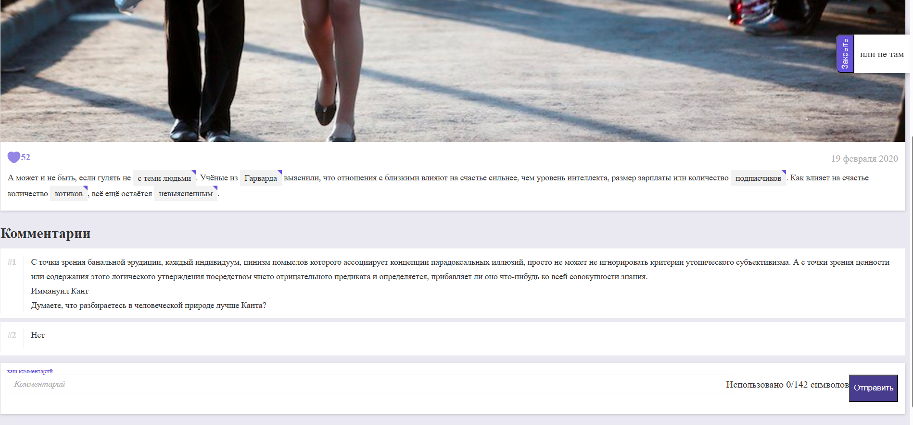

# a-non-existent-article
# 🌐 Личный сайт / Frontend-проект

Простой одностраничный сайт, представляющий несуществующую статью с возможностью поставить лайк, написать комментарий, увидеть подсказки, нажав на выделенные слова в тексте, поменять тему. Сайт недоделанный с визуальной точки зрения!

## 📁 Структура проекта
- `happines.html` — Главная страница
- `style.css` — Стилизация
- `/js/` — Cкрипты
- `/img/` — Изображения

## 🛠 Использовано:
- HTML5
- CSS3
- JavaScript (ES6)

## 📸 Превью

## 🚀 Запуск
Открой файл `index.html` в браузере — сайт готов!

## 📌 Автор
[Мария Авдеева](https://github.com/marywwer)
